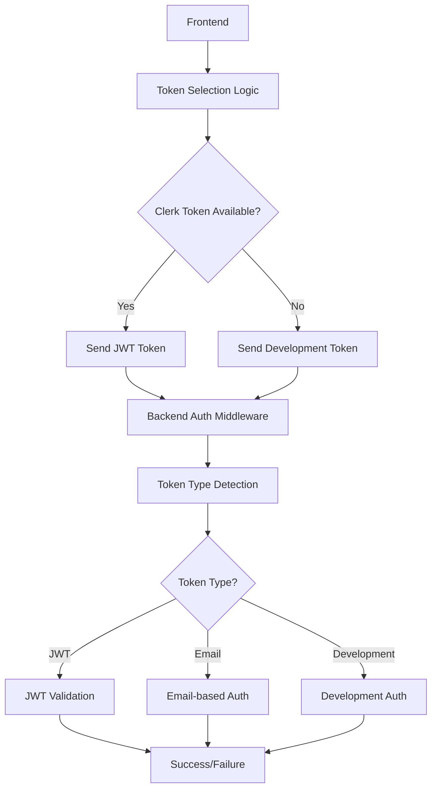
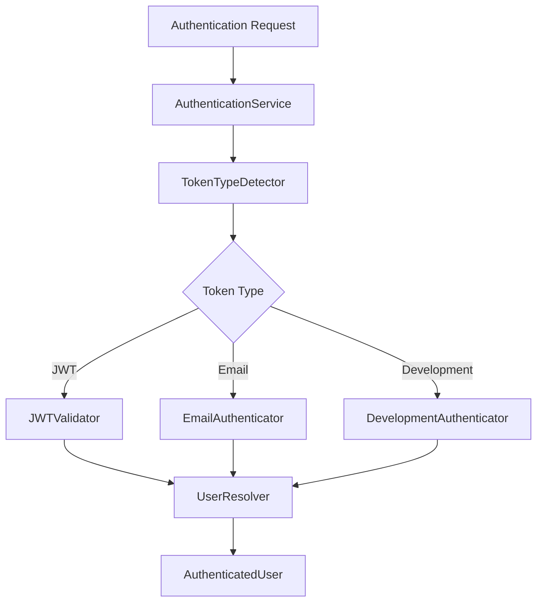

# Authentication Token Improvement Design

## Overview

This design addresses the authentication token handling issues by implementing proper token type detection, eliminating unnecessary JWT validation warnings, and improving the overall authentication flow. The solution maintains backward compatibility while providing cleaner logs and more robust authentication.

## Architecture

### Token Flow Architecture



### Authentication Service Architecture



## Components and Interfaces

### 1. Token Type Detector

```typescript
interface TokenTypeDetector {
  detectTokenType(token: string): TokenType;
}

enum TokenType {
  JWT = 'jwt',
  EMAIL = 'email',
  DEVELOPMENT = 'development'
}

class TokenTypeDetectorImpl implements TokenTypeDetector {
  detectTokenType(token: string): TokenType {
    if (token.startsWith('eyJ')) return TokenType.JWT;
    if (token.startsWith('dev:')) return TokenType.DEVELOPMENT;
    if (token.includes('@')) return TokenType.EMAIL;
    return TokenType.JWT; // Default assumption
  }
}
```

### 2. Authentication Strategy Interface

```typescript
interface AuthenticationStrategy {
  authenticate(token: string): Promise<AuthenticatedUser>;
  canHandle(tokenType: TokenType): boolean;
}

class JWTAuthenticationStrategy implements AuthenticationStrategy {
  canHandle(tokenType: TokenType): boolean {
    return tokenType === TokenType.JWT;
  }
  
  async authenticate(token: string): Promise<AuthenticatedUser> {
    // JWT validation logic
  }
}

class EmailAuthenticationStrategy implements AuthenticationStrategy {
  canHandle(tokenType: TokenType): boolean {
    return tokenType === TokenType.EMAIL;
  }
  
  async authenticate(token: string): Promise<AuthenticatedUser> {
    // Email-based authentication logic
  }
}

class DevelopmentAuthenticationStrategy implements AuthenticationStrategy {
  canHandle(tokenType: TokenType): boolean {
    return tokenType === TokenType.DEVELOPMENT;
  }
  
  async authenticate(token: string): Promise<AuthenticatedUser> {
    // Development authentication logic
  }
}
```

### 3. Enhanced Authentication Service

```typescript
class EnhancedAuthenticationService {
  private tokenDetector: TokenTypeDetector;
  private strategies: AuthenticationStrategy[];
  
  constructor() {
    this.tokenDetector = new TokenTypeDetectorImpl();
    this.strategies = [
      new JWTAuthenticationStrategy(),
      new EmailAuthenticationStrategy(),
      new DevelopmentAuthenticationStrategy()
    ];
  }
  
  async authenticateRequest(req: Request): Promise<{ auth: any; user: AuthenticatedUser }> {
    const token = this.extractToken(req);
    if (!token) {
      throw new AuthenticationError('Authentication token required', 'TOKEN_REQUIRED');
    }
    
    const tokenType = this.tokenDetector.detectTokenType(token);
    const strategy = this.strategies.find(s => s.canHandle(tokenType));
    
    if (!strategy) {
      throw new AuthenticationError('Unsupported token type', 'UNSUPPORTED_TOKEN_TYPE');
    }
    
    const user = await strategy.authenticate(token);
    return {
      auth: {
        userId: user.clerkId,
        sessionId: 'session-' + Date.now(),
        claims: { sub: user.clerkId },
        token,
        tokenType
      },
      user
    };
  }
}
```

### 4. Frontend Token Provider

```typescript
interface TokenProvider {
  getAuthToken(): Promise<string>;
  getTokenType(): TokenType;
}

class ClerkTokenProvider implements TokenProvider {
  constructor(private clerkAuth: any) {}
  
  async getAuthToken(): Promise<string> {
    try {
      const clerkToken = await this.clerkAuth.getToken();
      if (clerkToken) {
        return clerkToken;
      }
    } catch (error) {
      console.debug('Clerk token not available:', error);
    }
    
    // Fallback to development token
    const userEmail = this.clerkAuth.user?.primaryEmailAddress?.emailAddress;
    if (userEmail) {
      return `dev:${userEmail}`;
    }
    
    return 'dev:admin@bahinlink.com';
  }
  
  getTokenType(): TokenType {
    // This would be determined by the token content
    return TokenType.JWT; // or appropriate type
  }
}
```

## Data Models

### Enhanced Authentication Context

```typescript
interface EnhancedAuthContext {
  userId: string;
  sessionId: string;
  claims: any;
  token: string;
  tokenType: TokenType;
  authenticationMethod: 'jwt' | 'email' | 'development';
  authenticatedAt: Date;
}

interface AuthenticatedUser {
  id: string;
  clerkId: string;
  email: string;
  firstName?: string;
  lastName?: string;
  role: UserRole;
  status: UserStatus;
  permissions?: string[];
  accessLevel?: string;
  authenticationMethod: string;
  profileData?: {
    adminProfile?: any;
    clientProfile?: any;
    agentProfile?: any;
  };
}
```

### Token Validation Result

```typescript
interface TokenValidationResult {
  isValid: boolean;
  tokenType: TokenType;
  userId?: string;
  claims?: any;
  error?: string;
  authenticationMethod: string;
}
```

## Error Handling

### Authentication Error Types

```typescript
enum AuthenticationErrorCode {
  TOKEN_REQUIRED = 'TOKEN_REQUIRED',
  INVALID_TOKEN_TYPE = 'INVALID_TOKEN_TYPE',
  JWT_VALIDATION_FAILED = 'JWT_VALIDATION_FAILED',
  EMAIL_AUTH_FAILED = 'EMAIL_AUTH_FAILED',
  DEVELOPMENT_AUTH_FAILED = 'DEVELOPMENT_AUTH_FAILED',
  USER_NOT_FOUND = 'USER_NOT_FOUND',
  USER_INACTIVE = 'USER_INACTIVE'
}

class AuthenticationError extends Error {
  constructor(
    message: string,
    public code: AuthenticationErrorCode,
    public tokenType?: TokenType,
    public statusCode: number = 401
  ) {
    super(message);
    this.name = 'AuthenticationError';
  }
}
```

### Error Handling Strategy

1. **Token Type Detection Errors**: Log as debug, not warnings
2. **JWT Validation Errors**: Only log when actually validating JWT tokens
3. **Email Authentication Errors**: Log with appropriate context
4. **Development Authentication**: Log with development context markers

## Testing Strategy

### Unit Tests

1. **Token Type Detection Tests**
   - Test JWT token detection (starts with 'eyJ')
   - Test email token detection (contains '@')
   - Test development token detection (starts with 'dev:')
   - Test edge cases and malformed tokens

2. **Authentication Strategy Tests**
   - Test each strategy independently
   - Test strategy selection logic
   - Test error handling for each strategy

3. **Integration Tests**
   - Test full authentication flow
   - Test token type switching
   - Test error scenarios

### Frontend Tests

1. **Token Provider Tests**
   - Test Clerk token retrieval
   - Test fallback to development tokens
   - Test token formatting

2. **API Integration Tests**
   - Test authentication with different token types
   - Test error handling
   - Test circuit breaker functionality

### Backend Tests

1. **Middleware Tests**
   - Test authentication middleware with different token types
   - Test error responses
   - Test logging behavior

2. **Service Tests**
   - Test authentication service methods
   - Test user resolution
   - Test database interactions

## Implementation Phases

### Phase 1: Backend Token Type Detection
- Implement TokenTypeDetector
- Update authentication middleware
- Add proper logging

### Phase 2: Authentication Strategies
- Implement strategy pattern
- Separate JWT, email, and development authentication
- Update error handling

### Phase 3: Frontend Token Improvements
- Implement TokenProvider
- Update API service
- Add proper token formatting

### Phase 4: Testing and Validation
- Add comprehensive tests
- Validate log cleanliness
- Performance testing

## Security Considerations

1. **Token Validation**: Each token type has appropriate validation
2. **Development Mode**: Development tokens clearly marked and restricted
3. **Logging**: Sensitive information not logged
4. **Error Messages**: Don't reveal internal authentication details

## Performance Considerations

1. **Token Type Detection**: Fast string operations
2. **Strategy Selection**: O(1) lookup time
3. **Caching**: User data caching where appropriate
4. **Database Queries**: Optimized user lookups

## Monitoring and Observability

1. **Authentication Metrics**: Track authentication success/failure rates by type
2. **Performance Metrics**: Track authentication response times
3. **Error Tracking**: Categorize and track authentication errors
4. **Audit Logging**: Log authentication events for security auditing