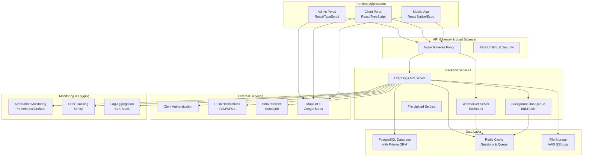

# Design Document: BahinLink System Completion

## Overview

This design document outlines the technical approach to complete the BahinLink Security Workforce Management System by fixing broken implementations, completing missing features, and ensuring production readiness. The design addresses specific issues identified in the codebase analysis while maintaining the existing architecture and technology stack.

The solution focuses on systematic completion of broken API integrations, frontend-backend connectivity issues, mobile app functionality, and infrastructure requirements to deliver a fully functional production system.

## Architecture

### Current Architecture Assessment

**Strengths:**
- Well-structured database schema with comprehensive entity relationships
- Modern technology stack (Node.js, React, React Native, PostgreSQL)
- Proper separation of concerns with distinct admin, client, and mobile applications
- Docker containerization foundation
- Authentication system using Clerk

**Critical Issues to Address:**
- Broken API endpoint implementations returning placeholder data
- Missing authentication middleware on protected routes
- Incomplete WebSocket real-time communication
- Non-functional frontend components with broken API calls
- Incomplete mobile app Redux store integration
- Missing production monitoring and logging

### Target Architecture



## Components and Interfaces

### 1. Backend API Completion

#### 1.1 Authentication Middleware Enhancement

**Current Issue:** Missing authentication on critical routes, inconsistent token validation

**Solution:**
```typescript
// Enhanced authentication middleware
interface AuthMiddleware {
  requireAuth: (req: Request, res: Response, next: NextFunction) => Promise<void>;
  requireRole: (roles: UserRole[]) => (req: Request, res: Response, next: NextFunction) => Promise<void>;
  optionalAuth: (req: Request, res: Response, next: NextFunction) => Promise<void>;
  validateClerkToken: (token: string) => Promise<ClerkUser>;
}

// Implementation approach
class AuthenticationService {
  async validateRequest(req: Request): Promise<AuthenticatedUser> {
    const token = this.extractToken(req);
    const clerkUser = await this.validateClerkToken(token);
    const dbUser = await this.getUserFromDatabase(clerkUser.id);
    return this.mergeUserData(clerkUser, dbUser);
  }
}
```

#### 1.2 Real Data API Endpoints

**Current Issue:** Many endpoints return placeholder data instead of database queries

**Solution:**
```typescript
// Replace placeholder implementations with real database queries
class AgentLocationService {
  async getCurrentAgentLocations(): Promise<AgentLocation[]> {
    return await prisma.trackingLog.findMany({
      where: {
        timestamp: {
          gte: new Date(Date.now() - 2 * 60 * 60 * 1000) // Last 2 hours
        }
      },
      include: {
        agent: {
          include: {
            user: true,
            currentSite: true
          }
        }
      },
      orderBy: {
        timestamp: 'desc'
      }
    });
  }
}

// Analytics endpoints with real calculations
class AnalyticsService {
  async getDashboardMetrics(userId: string, role: UserRole): Promise<DashboardMetrics> {
    const [agentStats, incidentStats, performanceStats] = await Promise.all([
      this.calculateAgentStatistics(userId, role),
      this.calculateIncidentStatistics(userId, role),
      this.calculatePerformanceMetrics(userId, role)
    ]);
    
    return {
      agentStats,
      incidentStats,
      performanceStats,
      timestamp: new Date().toISOString()
    };
  }
}
```

#### 1.3 WebSocket Real-Time Communication

**Current Issue:** Incomplete WebSocket implementation for real-time updates

**Solution:**
```typescript
// Complete WebSocket service implementation
class WebSocketService {
  private io: Server;
  private connectedUsers: Map<string, Socket> = new Map();
  
  initialize(server: http.Server) {
    this.io = new Server(server, {
      cors: {
        origin: process.env.ALLOWED_ORIGINS?.split(',') || ['http://localhost:3000'],
        credentials: true
      }
    });
    
    this.io.use(this.authenticateSocket.bind(this));
    this.io.on('connection', this.handleConnection.bind(this));
  }
  
  async handleConnection(socket: Socket) {
    const user = socket.data.user;
    this.connectedUsers.set(user.id, socket);
    
    // Join role-specific rooms
    socket.join(`role:${user.role}`);
    if (user.role === 'AGENT') {
      socket.join(`agent:${user.id}`);
    }
    
    socket.on('location_update', this.handleLocationUpdate.bind(this, socket));
    socket.on('disconnect', () => this.connectedUsers.delete(user.id));
  }
  
  broadcastLocationUpdate(agentId: string, locationData: LocationUpdate) {
    this.io.to('role:SUPERVISOR').to('role:ADMIN').emit('agent_location_update', {
      agentId,
      ...locationData,
      timestamp: new Date().toISOString()
    });
  }
}
```

### 2. Frontend Application Fixes

#### 2.1 Admin Portal API Integration

**Current Issue:** Scheduling page loads empty arrays, monitoring page has broken Google Maps

**Solution:**
```typescript
// Fixed scheduling page with proper API integration
class SchedulingService {
  async loadSchedulingData(): Promise<SchedulingData> {
    const [agents, sites, shifts] = await Promise.all([
      this.apiClient.get('/api/agents/active'),
      this.apiClient.get('/api/sites'),
      this.apiClient.get('/api/shifts', {
        params: {
          startDate: startOfWeek(new Date()).toISOString(),
          endDate: endOfWeek(new Date()).toISOString()
        }
      })
    ]);
    
    return {
      agents: agents.data,
      sites: sites.data,
      shifts: shifts.data
    };
  }
  
  async createShift(shiftData: CreateShiftRequest): Promise<Shift> {
    const response = await this.apiClient.post('/api/shifts', shiftData);
    return response.data;
  }
}

// Fixed monitoring page with proper Google Maps integration
const RealTimeMonitoringPage: React.FC = () => {
  const [agentLocations, setAgentLocations] = useState<AgentLocation[]>([]);
  const [mapLoaded, setMapLoaded] = useState(false);
  
  useEffect(() => {
    const loadGoogleMaps = async () => {
      if (!window.google) {
        await loadScript(`https://maps.googleapis.com/maps/api/js?key=${process.env.REACT_APP_GOOGLE_MAPS_API_KEY}&libraries=geometry`);
      }
      setMapLoaded(true);
    };
    
    loadGoogleMaps();
  }, []);
  
  // Rest of component implementation with proper error handling
};
```

#### 2.2 Client Portal Service Requests Fix

**Current Issue:** Broken API calls, non-functional download buttons

**Solution:**
```typescript
// Fixed service requests with proper authentication and error handling
class ServiceRequestService {
  async fetchServiceRequests(): Promise<ServiceRequest[]> {
    try {
      const token = await this.authService.getToken();
      const response = await fetch(`${API_BASE_URL}/client/service-requests`, {
        headers: {
          'Authorization': `Bearer ${token}`,
          'Content-Type': 'application/json'
        }
      });
      
      if (!response.ok) {
        throw new Error(`HTTP ${response.status}: ${await response.text()}`);
      }
      
      const data = await response.json();
      return data.requests || [];
    } catch (error) {
      console.error('Failed to fetch service requests:', error);
      throw new ServiceRequestError('Unable to load service requests', error);
    }
  }
  
  async downloadReport(reportId: string): Promise<Blob> {
    const token = await this.authService.getToken();
    const response = await fetch(`${API_BASE_URL}/reports/${reportId}/download`, {
      headers: {
        'Authorization': `Bearer ${token}`
      }
    });
    
    if (!response.ok) {
      throw new Error('Failed to download report');
    }
    
    return await response.blob();
  }
}
```

### 3. Mobile App Redux Integration

#### 3.1 Complete Redux Store Implementation

**Current Issue:** Redux actions fail due to missing API endpoints and incomplete async logic

**Solution:**
```typescript
// Fixed shift slice with proper error handling
export const fetchMyShifts = createAsyncThunk(
  'shift/fetchMyShifts',
  async (_, { rejectWithValue, getState }) => {
    try {
      const state = getState() as RootState;
      const token = state.auth.token;
      
      if (!token) {
        throw new Error('No authentication token available');
      }
      
      const response = await apiClient.get('/mobile/shifts/my-shifts', {
        headers: {
          'Authorization': `Bearer ${token}`
        }
      });
      
      return response.data;
    } catch (error: any) {
      return rejectWithValue(
        error.response?.data?.message || 'Failed to fetch shifts'
      );
    }
  }
);

// Offline sync implementation
export const syncOfflineData = createAsyncThunk(
  'offline/syncData',
  async (_, { getState, dispatch }) => {
    const state = getState() as RootState;
    const offlineQueue = state.offline.queue;
    
    const results = await Promise.allSettled(
      offlineQueue.map(async (item) => {
        switch (item.type) {
          case 'LOCATION_UPDATE':
            return dispatch(syncLocationUpdate(item.data));
          case 'REPORT_SUBMISSION':
            return dispatch(syncReportSubmission(item.data));
          case 'ATTENDANCE_RECORD':
            return dispatch(syncAttendanceRecord(item.data));
          default:
            throw new Error(`Unknown sync type: ${item.type}`);
        }
      })
    );
    
    return results;
  }
);
```

#### 3.2 Camera and Media Upload Implementation

**Current Issue:** Camera/media upload not implemented

**Solution:**
```typescript
// Complete media upload service
class MediaUploadService {
  async captureAndUploadPhoto(options: CameraOptions): Promise<UploadResult> {
    try {
      // Request camera permissions
      const { status } = await Camera.requestCameraPermissionsAsync();
      if (status !== 'granted') {
        throw new Error('Camera permission denied');
      }
      
      // Capture photo
      const result = await ImagePicker.launchCameraAsync({
        mediaTypes: ImagePicker.MediaTypeOptions.Images,
        allowsEditing: true,
        aspect: [4, 3],
        quality: 0.8,
      });
      
      if (result.canceled) {
        throw new Error('Photo capture cancelled');
      }
      
      // Compress and prepare for upload
      const compressedImage = await this.compressImage(result.assets[0]);
      
      // Upload to server
      return await this.uploadFile(compressedImage, 'image');
    } catch (error) {
      console.error('Photo capture/upload failed:', error);
      throw error;
    }
  }
  
  private async compressImage(asset: ImagePicker.ImagePickerAsset): Promise<CompressedImage> {
    const manipResult = await ImageManipulator.manipulateAsync(
      asset.uri,
      [{ resize: { width: 1024 } }],
      { compress: 0.8, format: ImageManipulator.SaveFormat.JPEG }
    );
    
    return {
      uri: manipResult.uri,
      type: 'image/jpeg',
      name: `photo_${Date.now()}.jpg`,
      size: asset.fileSize || 0
    };
  }
  
  private async uploadFile(file: CompressedImage, type: 'image' | 'video'): Promise<UploadResult> {
    const formData = new FormData();
    formData.append('file', {
      uri: file.uri,
      type: file.type,
      name: file.name
    } as any);
    formData.append('type', type);
    
    const response = await apiClient.post('/mobile/upload', formData, {
      headers: {
        'Content-Type': 'multipart/form-data',
      },
      onUploadProgress: (progressEvent) => {
        const progress = (progressEvent.loaded / progressEvent.total) * 100;
        this.notifyUploadProgress(progress);
      }
    });
    
    return response.data;
  }
}
```

## Data Models

### Enhanced API Response Models

```typescript
// Standardized API response format
interface ApiResponse<T> {
  success: boolean;
  data: T;
  message?: string;
  errors?: ValidationError[];
  pagination?: PaginationInfo;
  timestamp: string;
}

// Enhanced error handling
interface ValidationError {
  field: string;
  message: string;
  code: string;
}

// Real-time update models
interface LocationUpdate {
  agentId: string;
  latitude: number;
  longitude: number;
  accuracy: number;
  timestamp: string;
  batteryLevel?: number;
  speed?: number;
  heading?: number;
}

interface AgentStatus {
  agentId: string;
  status: 'ACTIVE' | 'INACTIVE' | 'BREAK' | 'EMERGENCY';
  shiftId?: string;
  siteId?: string;
  lastUpdate: string;
}
```

## Error Handling

### Comprehensive Error Management Strategy

```typescript
// Centralized error handling
class ErrorHandler {
  static handle(error: Error, context: string): void {
    // Log error with context
    logger.error(`Error in ${context}:`, {
      message: error.message,
      stack: error.stack,
      context,
      timestamp: new Date().toISOString()
    });
    
    // Send to error tracking service
    if (process.env.NODE_ENV === 'production') {
      Sentry.captureException(error, {
        tags: { context },
        extra: { timestamp: new Date().toISOString() }
      });
    }
  }
  
  static createApiError(message: string, statusCode: number, code?: string): ApiError {
    return new ApiError(message, statusCode, code);
  }
}

// Frontend error boundary
class ApiErrorBoundary extends React.Component {
  state = { hasError: false, error: null };
  
  static getDerivedStateFromError(error: Error) {
    return { hasError: true, error };
  }
  
  componentDidCatch(error: Error, errorInfo: React.ErrorInfo) {
    console.error('API Error Boundary caught an error:', error, errorInfo);
    // Send error to monitoring service
  }
  
  render() {
    if (this.state.hasError) {
      return <ErrorFallback error={this.state.error} />;
    }
    
    return this.props.children;
  }
}
```

## Testing Strategy

### Comprehensive Testing Approach

```typescript
// API endpoint testing
describe('Shifts API', () => {
  beforeEach(async () => {
    await setupTestDatabase();
    await seedTestData();
  });
  
  it('should fetch agent shifts with proper authentication', async () => {
    const token = await generateTestToken('AGENT');
    const response = await request(app)
      .get('/api/shifts')
      .set('Authorization', `Bearer ${token}`)
      .expect(200);
    
    expect(response.body.success).toBe(true);
    expect(response.body.data).toBeInstanceOf(Array);
  });
  
  it('should reject unauthenticated requests', async () => {
    await request(app)
      .get('/api/shifts')
      .expect(401);
  });
});

// Frontend component testing
describe('SchedulingPage', () => {
  it('should load and display scheduling data', async () => {
    const mockData = {
      agents: [{ id: '1', name: 'Test Agent' }],
      sites: [{ id: '1', name: 'Test Site' }],
      shifts: []
    };
    
    jest.spyOn(schedulingService, 'loadSchedulingData').mockResolvedValue(mockData);
    
    render(<SchedulingPage />);
    
    await waitFor(() => {
      expect(screen.getByText('Test Agent')).toBeInTheDocument();
      expect(screen.getByText('Test Site')).toBeInTheDocument();
    });
  });
});

// Mobile app testing
describe('ShiftsScreen', () => {
  it('should dispatch fetchMyShifts on focus', () => {
    const mockDispatch = jest.fn();
    jest.spyOn(require('react-redux'), 'useDispatch').mockReturnValue(mockDispatch);
    
    render(<ShiftsScreen navigation={mockNavigation} />);
    
    expect(mockDispatch).toHaveBeenCalledWith(expect.any(Function));
  });
});
```

## Security Implementation

### Enhanced Security Measures

```typescript
// Input validation middleware
const validateRequest = (schema: Joi.Schema) => {
  return (req: Request, res: Response, next: NextFunction) => {
    const { error } = schema.validate(req.body);
    if (error) {
      return res.status(400).json({
        success: false,
        message: 'Validation failed',
        errors: error.details.map(detail => ({
          field: detail.path.join('.'),
          message: detail.message,
          code: detail.type
        }))
      });
    }
    next();
  };
};

// Rate limiting
const createRateLimiter = (windowMs: number, max: number) => {
  return rateLimit({
    windowMs,
    max,
    message: {
      success: false,
      message: 'Too many requests, please try again later'
    },
    standardHeaders: true,
    legacyHeaders: false
  });
};

// File upload security
const secureFileUpload = multer({
  storage: multer.memoryStorage(),
  limits: {
    fileSize: 10 * 1024 * 1024, // 10MB
    files: 5
  },
  fileFilter: (req, file, cb) => {
    const allowedTypes = ['image/jpeg', 'image/png', 'image/gif', 'video/mp4'];
    if (allowedTypes.includes(file.mimetype)) {
      cb(null, true);
    } else {
      cb(new Error('Invalid file type'));
    }
  }
});
```

This design provides a comprehensive approach to fixing all identified issues while maintaining the existing architecture and ensuring production readiness.